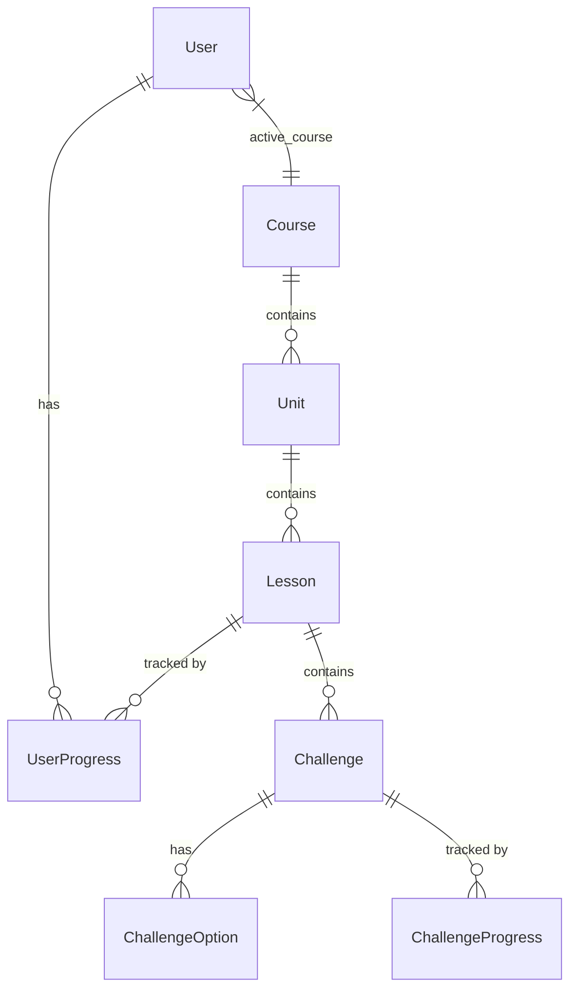

# 🦉 Duolingo Clone

A full-stack, highly interactive language learning application that recreates the core Duolingo experience, featuring a gamified path, an interactive lesson engine, and persistent user progress.

> **Live Demo:** [https://duolingo-clone-five-bice.vercel.app](https://duolingo-clone-five-bice.vercel.app)
> *(Note: The live demo is hosted on a free tier and may take ~1 minute to load initially. Please be patient!)*
> **GitHub Repository:** [https://github.com/techi101/duolingo-assignment](https://github.com/techi101/duolingo-assignment)

---

## 🎨 Visual Theme & Design
The application utilizes a color palette inspired by Duolingo’s signature aesthetic:
*   **Primary Green (`#58cc02`)**: Used for primary actions and progress bars.
*   **Neutral Slate/Gray**: Used for structure, ensuring high contrast in both Light and Dark modes.
*   **UI Patterns**: Rounded buttons, bouncy animations, and clear progress rings to mimic the authentic Duolingo experience.

---

## 🚀 Tech Stack
*   **Frontend**: Next.js 16 (App Router), React, Tailwind CSS, Zustand, Radix UI.
*   **Backend**: FastAPI (Python), SQLAlchemy (ORM).
*   **Database**: SQLite (local development).

## 🏗 Architecture Overview
1. **Frontend**: Next.js handles server-side rendering and state changes via **Zustand**.
2. **Backend**: **FastAPI** provides RESTful endpoints with **Pydantic** type validation.
3. **Database**: Relational schema managed by **SQLAlchemy** to maintain hierarchical integrity.

## 🗄 Database Schema

## 🔌 API Overview
The FastAPI backend exposes several RESTful endpoints to manage courses, lessons, and user progress. 
Key endpoints include:
- `GET /courses`: Retrieves available language courses.
- `GET /units`: Fetches units and lessons for the user's active course.
- `GET /lessons/{lesson_id}`: Loads challenges (multiple choice, match, type) for a specific lesson.
- `POST /challenge-progress`: Records completed challenges, awards XP, and updates streaks.
- `GET /users/me` & `PUT /users/me`: Manages the current user's profile and avatar.
- `GET /achievements`: Calculates and returns unlocked achievements based on user XP and streaks.
- `POST /reduce-hearts` & `POST /refill-hearts`: Manages the gamified health system.
- `GET /leaderboard`: Returns top users ranked by XP.

## Design Decisions & Trade-offs
- **Next.js App Router**: Chosen for its seamless Server-Side Rendering (SSR) capabilities and integrated API routes, allowing for rapid frontend iteration and optimized page loads.
- **FastAPI Backend**: Selected over Express.js/Node for its native Pydantic validation, enforcing strict type-safety on all incoming payloads to ensure backend resilience against malformed client requests.
- **Zustand for State**: Chosen over Redux for its minimal boilerplate, specifically to handle the complex, rapid state changes required by the highly interactive lesson player.
- **Relational Mapping (SQLite/SQLAlchemy)**: Opted for a relational database instead of NoSQL to strictly enforce the hierarchical structure of Courses -> Units -> Lessons -> Challenges, maintaining data integrity through foreign keys.

## Setup Instructions

### Prerequisites
- Node.js (v18+)
- Python (3.9+)

### 1. Backend Setup
Navigate to the backend directory and set up the Python environment:
```bash
cd backend
python -m venv venv

# On Windows:
.\venv\Scripts\activate
# On Mac/Linux:
source venv/bin/activate

pip install -r requirements.txt
```

**Seed the Database:**
To generate the initial courses, lessons, and leaderboard users, run the seed script:
```bash
python seed.py
```

**Run the Backend Server:**
```bash
fastapi dev main.py
# The API will run on http://localhost:8000
```

### 2. Frontend Setup
Open a new terminal window, navigate to the frontend directory:
```bash
cd frontend
npm install
```

**Run the Frontend Server:**
```bash
npm run dev
# The app will run on http://localhost:3000
```

## Assumptions Made
- A single mock user is automatically authenticated for demonstration purposes (simulating a logged-in state).
- The text-to-speech engine relies on the browser's native `SpeechSynthesis` API.
