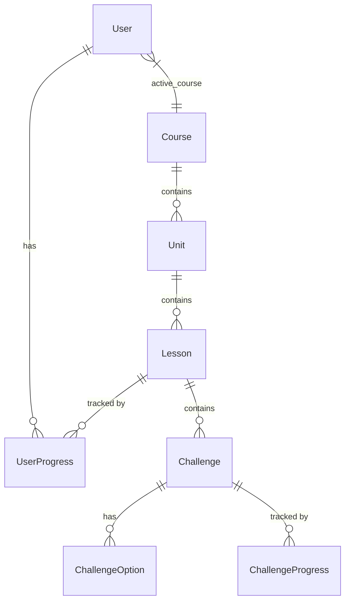

# Duolingo Clone

A full-stack, highly interactive Duolingo clone featuring gamified language learning, interactive lessons, persistent progress tracking, and a playful UI.

## Tech Stack
- **Frontend**: Next.js 16 (App Router), React, Tailwind CSS, Zustand (state management), Radix UI (accessible components).
- **Backend**: FastAPI (Python), SQLAlchemy (ORM).
- **Database**: SQLite (local development).

## Core Features Implemented
- **Learning Path**: Visual SVG-based tree with locked/unlocked progress states.
- **Interactive Lessons**: Supports Multiple Choice (with images), Translation, Type-the-Answer, and Match-the-Pairs exercises. Includes native Text-to-Speech (TTS) integration.
- **Gamification**: Real-time streak tracking, XP accumulation, daily quests, and heart mechanics (lose a heart on failure, regain by practicing or purchasing with XP).
- **Social & Profile**: Dynamic leaderboard tracking all users, and a robust Profile page featuring unlockable achievements.
- **Responsive UI**: Pixel-perfect UI recreating the authentic Duolingo experience on both desktop and mobile devices.

## Architecture Overview
The application follows a decoupled client-server architecture:
1. **Frontend**: A Next.js application that handles rendering, client-side state (Zustand), and complex animations (React-Confetti). It uses Server Actions and standard `fetch` calls to communicate with the backend.
2. **Backend**: A FastAPI server that provides RESTful endpoints to manage user states, validate lesson answers, and track progress.
3. **Database**: A relational SQLite database accessed via SQLAlchemy.

## Database Schema Design
The database consists of tightly related entities designed to track granular user progress:
- **User**: Stores username, XP, streak, hearts, active course, and last active date.
- **Course**: The high-level language course (e.g., Spanish, English).
- **Unit**: A subdivision of a course, containing a specific theme and order.
- **Lesson**: A sequence of challenges within a unit.
- **Challenge**: Individual exercises (SELECT, ASSIST, TYPE_ANSWER, MATCH_PAIRS).
- **ChallengeOption**: The possible answers for a given challenge, marked with boolean correct flags and optional image/audio sources.
- **UserProgress / ChallengeProgress**: Join tables that persistently track which lessons and specific challenges a user has completed, driving the visual lock/unlock path on the frontend.



## Design Decisions & Trade-offs
- **Next.js App Router**: Chosen for its seamless Server-Side Rendering (SSR) capabilities and integrated API routes, allowing for rapid frontend iteration and optimized page loads.
- **FastAPI Backend**: Selected over Express.js/Node for its native Pydantic validation, enforcing strict type-safety on all incoming payloads to ensure backend resilience against malformed client requests.
- **Zustand for State**: Chosen over Redux for its minimal boilerplate, specifically to handle the complex, rapid state changes required by the highly interactive lesson player.
- **Relational Mapping (SQLite/SQLAlchemy)**: Opted for a relational database instead of NoSQL to strictly enforce the hierarchical structure of Courses -> Units -> Lessons -> Challenges, maintaining data integrity through foreign keys.

## Setup Instructions

### Prerequisites
- Node.js (v18+)
- Python (3.9+)

### 1. Backend Setup
Navigate to the backend directory and set up the Python environment:
```bash
cd backend
python -m venv venv

# On Windows:
.\venv\Scripts\activate
# On Mac/Linux:
source venv/bin/activate

pip install -r requirements.txt
```

**Seed the Database:**
To generate the initial courses, lessons, and leaderboard users, run the seed script:
```bash
python seed.py
```

**Run the Backend Server:**
```bash
fastapi dev main.py
# The API will run on http://localhost:8000
```

### 2. Frontend Setup
Open a new terminal window, navigate to the frontend directory:
```bash
cd frontend
npm install
```

**Run the Frontend Server:**
```bash
npm run dev
# The app will run on http://localhost:3000
```

## Assumptions Made
- A single mock user is automatically authenticated for demonstration purposes (simulating a logged-in state).
- The text-to-speech engine relies on the browser's native `SpeechSynthesis` API.
