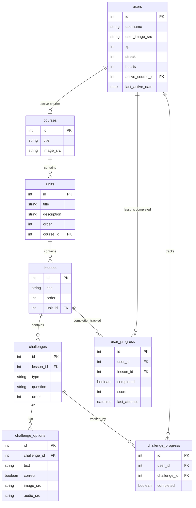

# 🦜 Duolingo Fullstack Clone

A modern, highly gamified Duolingo clone designed to showcase lesson loops, gamification mechanics, user stats, and progress persistence. Built with a robust Next.js frontend and a FastAPI backend with SQLite database.

## 🚀 Quick Start & Installation

### Prerequisites
- Node.js (v18+)
- Python (v3.10+)

### Setup Backend & Seed Database
1. Navigate to the backend folder:
   ```bash
   cd backend
   ```
2. Create and activate a Python virtual environment:
   ```bash
   python -m venv venv
   # On Windows (PowerShell/Cmd):
   venv\Scripts\activate
   # On Linux/macOS:
   source venv/bin/activate
   ```
3. Install dependencies:
   ```bash
   pip install -r requirements.txt
   ```
4. Run the seed script to initialize the SQLite database and populate courses, lessons, challenges, and mock leaderboard users:
   ```bash
   python seed.py
   ```
5. Run the FastAPI development server:
   ```bash
   uvicorn main:app --port 8000 --reload
   ```
   *The API will be available at [http://localhost:8000](http://localhost:8000) with automatic OpenAPI docs at `/docs`.*

---

### Setup Frontend
1. Open a new terminal and navigate to the frontend folder:
   ```bash
   cd frontend
   ```
2. Install npm dependencies:
   ```bash
   npm install
   ```
3. Start the Next.js (Turbopack) development server:
   ```bash
   npm run dev
   ```
4. Open your browser and go to: [http://localhost:3000](http://localhost:3000)

---

## 🛠️ Tech Stack & Architecture

### Frontend (Next.js)
- **Framework:** Next.js (TypeScript) using App Router.
- **Styling:** TailwindCSS, CSS Variables, Lucide icons.
- **State Management:** Zustand (modal state coordination).
- **Interactions:** Framer Motion-style layout transitions, react-confetti on completion, native audio assets for immediate user feedback.
- **Data Mutators:** Next.js Server Actions fetching directly from the FastAPI server.

### Backend (Python FastAPI)
- **API Framework:** FastAPI (high performance, automatic Swagger/OpenAPI docs, Pydantic type validation).
- **ORM:** SQLAlchemy for SQLite connectivity.
- **Database:** SQLite (local file database: `database.db`).

---

## 🗄️ Database Schema & Architecture



---

## 🌟 Implemented Core & Bonus Features

### Core Workflows (Must Have)
1. **Interactive Path / Skill Tree:** A visual grid-like structure mapping units, sections, and lesson lock/unlock states based on completion progress. Includes path layout mirroring Duolingo's signature styling.
2. **Dynamic Lesson Player:** Supports four fully interactive exercise types:
   - `SELECT`: Choose the correct image/text.
   - `ASSIST`: Select the translation for a highlighted word.
   - `TYPE_ANSWER`: Text input matching (case-insensitive) for quick keyboard test.
   - `MATCH_PAIRS`: Tap cards on both sides to match terms in interactive list.
3. **Immediate Verification & Feedback:** Complete bar overlays (green for correct, red/rose for wrong), sound effects for correct/wrong/finish, and screen-wide confetti when completing a lesson.
4. **Gamification & Progress Logic:**
   - **Hearts System:** Track hearts. Deducts 1 heart on a wrong answer. Refill/regenerate via shop using points/XP.
   - **Streak Logic:** Track last active day. Increments streak when completed on consecutive days; resets if a gap day is detected.
   - **Leaderboard:** Dynamic list showing top users.
   - **Quests:** Track dynamic visual progress towards daily XP milestone goals.

### Bonus / Optional Additions
- **Audio Integration:** Play correct, incorrect, and finish sound clips to match the Duolingo gamified experience.
- **Detailed Learner Profile Page (`/profile`):** Comprehensive stats dashboard including completed lessons/challenges counters, XP milestones progress tracking, and achievements section.
- **Achievements System:** Unlock achievements automatically based on XP milestones and streak requirements. Earned achievements visually light up with completion badges.

---

## 💡 Assumptions & Implementation Decisions
- **Simplified Authentication:** Single local logged-in user context (`MOCK_USER_ID = 1`) used across all endpoints for ease of testing.
- **Daily Streak Logic:** Simulates a 24-hour day checking local date system comparison (`today` vs `yesterday`). If the time gap is greater than one day, the streak resets to 1 upon the next successful lesson completion.
